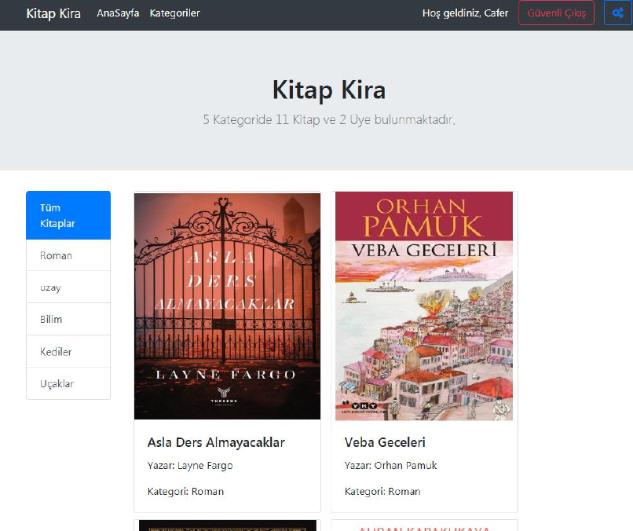
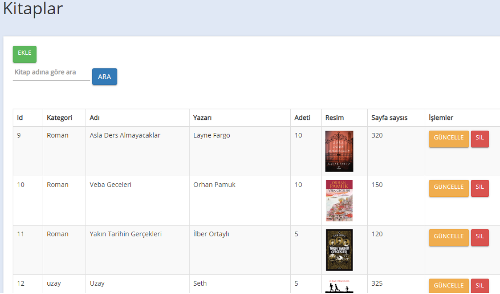

# Java JSP Book Rental System

Management of book rental.

## Used Tools
- Java Server Pages (JSP)
### Web Server
- Apache Tomcat
### Database
- MS SQL Server 

## Features
- user self registration
- CRUD for books, users, categorys.
- Delayed rental time checking.

> ⚠️ For more details: [Report](./report.pdf)

## Screenshots
### User Interface

   

### Admin Panel

  

### Admin Book Listing 

  

## License
MIT
